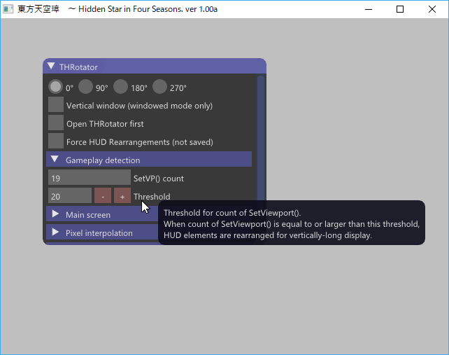
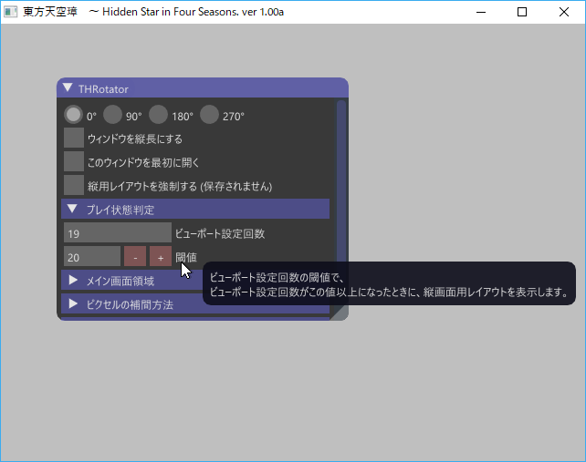

======================
Release notes
======================

2.1.0
=====

Released on May 2, 2021.

New feature
-----------

* Add support on borderless window.

2.0.3 with Touhou 16.5 config
=============================

Released on September 9, 2018.

Adding config file for Touhou 16.5.
No change in the DLLs.

2.0.3
=====

Released on September 27, 2017.

Bug fix
-------

* Fix invisible mouse cursor in fullscreen mode on Direct3D 8.

Improvement
-----------

* Batch file to open the directory of player's data.

Others
------

* Discard using legacy D3DX.
* Unify ImGui bindings to D3D8 and D3D9.

2.0.2
=====

Released on September 10, 2017.

Bug fix
-------

* Fix unable to assign a negative value for y-offset.
  This results in rendering misalignment on a game such as Touhou 12.5 after
  beginning to edit y-offset.

2.0.1
=====

Released on September 10, 2017.

Bug fix
-------

* Fix wrong threshold in configuration file for released version (1.00b) of Touhou 14.
* Fix a modification actually made in 2.0.0 is missing in the release note on 2.0.0.

  * The modification is to review Touhou 16 configuration file (see release note on 2.0.0 for detail). 

2.0.0
=====

Released on September 9, 2017.

New feature
-----------

* Inline GUI allowing faster and more intuitive configuration.
  |thr_sample_screenshot_en|
  Background is gray for easy redistribution.

  * Your input by keyboard or mouse dragging will be immediately reflected to actual rendering.

* Online manual is now hosted by `Read the Docs <https://readthedocs.org/>`_.

Improvement
-----------

* Review Touhou 16 configuration file.

  * Larger bottom space for enemy indicator.
  * Remove aspect ratio distortion.
  * Move next score for extend to the bottom of current score.

1.3.1
=======================

Released on August 16, 2017.

New feature
------------

- Save logs to ``throtator-log.txt``

Bug fixes
------------

- Fix unexpected screen rotation when clicking apply button after clicking a radio button of interpolation method.
- Fix division by zero depending on the initialization method of Direct3D.
- Fix unnecessary values in configuration files.
- Fix null in configuration file when the number of other rectangles is zero.

1.3.0
=======================

Released on August 12, 2017.

New features
---------------

- Config for Th16.
- Forced HUD rearrangements.
- Internationalized user interface (currently English and Japanese).
- User's manual generated by Sphinx (English and Japanese).
- Experimental support on Direct3D 9 Ex. Hopefully wider support on non-Touhou Project games.
- On Touhou Project games running on Direct3D 8, except for Touhou 7, the game doesn't stop while the editor window is open.
  This makes it easier to check the result of your modification.
- New design of configuration files.

  - Previous design required to rename files to install and to edit .ini files directly to support a new game.
  - New design doesn't need renaming and an older game's configuration file can be used for a new game.
  - THRotator can read the previous ``throt.ini``. Configuration file is converted to new format upon next save.

Bug fixes
---------------

- Fix fixed window resolusion to 640x480 from Th11 to Th13 in windowed mode.
- Fix that some implemented methods of D3D interfaces return unexpected values.
- Fix the issue Touhou 7 does not accept any player's inputs
  when `DX8 to DX9 converter <http://enbdev.com/download_convertor_dx8todx9.htm>`_ and ``d3d9.dll`` of THRotator are installed at the same time.
- Fix the issue threshould input by user was compared with wrong count of setting viewports on Touhou 6 and 7.

  - THRotator converts the threshold to the correct one on Touhou 6 and 7 while reading config in the old format.

Others
---------------

- Lots of refactoring
- Introducing CMake for supporting multiple Visual Studio versions.

1.2.2
=======================

Released on May 28, 2017.

Bug fixes
---------

No fix regarding functionality.

- Fix obsolete version number string.

1.2.1
=======================

Released on May 28, 2017.

Bug fixes
---------

- Fix black screen when chosen resolution is wider or taller than screen in windowed mode.
- Fix black stripe when monitor resolution is smaller than game resolution in fullscreen mode.
- Fix crash when throt.ini is not writable.

1.2.0
=======================

Released on May 14, 2017.

Bug fixes
---------

- Fix black screen on Touhou 15
- Add support on higher resolutions (960x720, 1280x960)

Others
---------

- Faster throt.ini I/O
- Versioning by Semantic Versioning 2.0
- Lots of refactoring

1.01
======================

Released on Aug 18, 2011.

Magnification of screen with aspect ratio fixed.

1.00
======================

Released on Aug 14, 2011.

The first release.

On Aug 16, 2011, the default HUD arrangements for Th13 was fixed.
