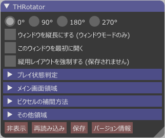

=====================
How to use
=====================

Rotate a screen
=====================

By pressing ``Alt+Left`` or ``Alt+Right``, the screen is rotated by 90 degrees in left or right direction.
When entire screen aspect ratio, seen from rotated screen viewpoint, is smaller than the original,
THRotator tries to magnify main screen region to as large size as possible while you are playing or watching replay data.

Screen capture on Touhou 6
========================================

THRotator allows to capture a screen into a .bmp file by pressing ``Home`` key on Touhou 6,
which is unsupported on the original Touhou 6.

The destination is ``snapshot`` folder in the installed directory,
which is the same as that since Touhou 7 until Touhou 12.

.. _usage_force_vertical:

Force HUD rearrangements
========================

HUD rearrangements for vertical screen are forced with ``Alt+Up`` and ``Alt+Down`` keys.
This option is useful when you want to manually switch to HUD arrangements for vertically-long screen.

THRotator detects whether you are playing or not by the criterion described in :ref:`usage_state_detection`.
If you would like to use THRotator on a newer Touhou Project game or a game other than Touhou Project
on which this detection methodology doesn't work,
use this feature or check ``Force HUD Rearrangements`` checkbox in the cutomization window.

.. note:: This config is not saved due to its large effect.

Customization window
=====================

.. |thr_win_en| image:: ../images/throtator-window-en.png

|thr_win_en|

Customization window can be shown by one of the following ways:

* Right-click on the title bar, and click ``Show THRotator window``.
* Type ``Alt+0``.

For detailed description of each element in this window, refer to help texts
that appears by hovering buttons, input fields, and other GUI elements.

.. _usage_state_detection:

Gameplay detection
=======================

.. |thr_win_gd_en| image:: ../images/throtator-window-gamedetec-en.png

|thr_win_gd_en|

THRotator detects by counting setting viewport whether you are playing (we call it playing state) or not.
In Touhou Project, viewport is updated more frequently while playing state than otherwise.
THRotator exploits this fact to automatically switch to an HUD arrangement for vertically-long screen.

``SetVP() count`` always shows the number of times of setting viewport.
If number of times of setting viewport is equal to or more than the threshold, HUD elements are arranged for vertically-long screen.

If THRotator fails to read configuration file, the threshold is set to 999 by default to prevent unintentional switching.

If you would like to use THRotator on a newer Touhou Project game or a game other than Touhou Project
on which this detection methodology doesn't work,
follow :ref:`usage_force_vertical` or check ``Force HUD Rearrangements`` checkbox in the cutomization window.

Best practices
=======================

Procedure to support a new product looks like as follows:

1. Measure times of setting viewport in playing state and non-playing state respectively,
   determine a value larger than that in non-playing state and smaller than or equal to that in playing state,
   and fill the threshold by that value.
   
   * Please measure this value while challenging a spell card since it generally becomes fewer.
   
2. Fill main screen position and size.
3. Add rectangle transfers for the scores, lives, and other HUD elements.

